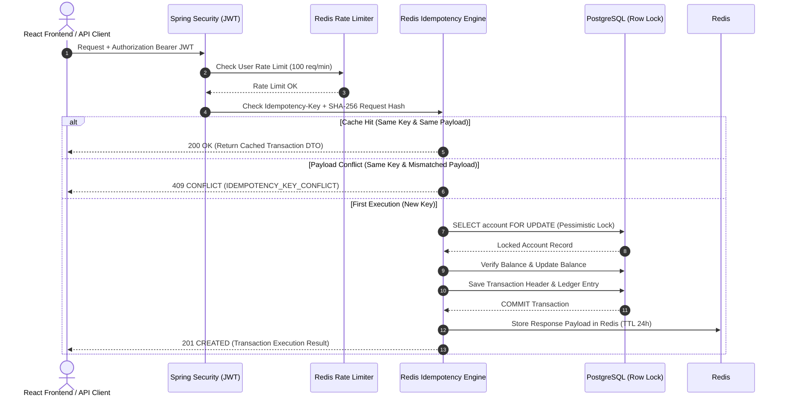

# 🛡️ SecurePay — Full-Stack Idempotent Payment Processing System

SecurePay is a production-grade, full-stack payment processing platform built to demonstrate **strict request idempotency**, **row-level pessimistic locking**, **JWT multi-tenant authorization**, **Redis rate limiting**, and **decimal-precision ledger transaction accounting**.

Built with **Java 21, Spring Boot 3, PostgreSQL 15, Redis 7, React 19, TypeScript, Vite, Tailwind CSS, Flyway, and Docker Compose**.

---

## 📖 System Architecture

SecurePay prevents double-charging caused by network retries or malicious duplicate submissions using a multi-tiered defense:



---

## ✨ Core Engineering Features

### 1. Advanced SHA-256 Request Fingerprinting Idempotency
- Requires a mandatory `Idempotency-Key` header on financial operations.
- Generates a SHA-256 hash derived from `accountId:amount:type:currency`.
- Re-executes `0` database queries for duplicate key matches, returning a `200 OK` cached payload.
- Detects key reuse with mismatched parameters and rejects with `409 CONFLICT`.
- Atomic set-if-absent locking prevents concurrent duplicate requests from bypassing cache checks.

### 2. Concurrency Control with Pessimistic Locking
- Uses PostgreSQL database row-level locking via JPA:
  ```sql
  SELECT * FROM account WHERE id = ? FOR UPDATE;
  ```
- Prevents race conditions, lost updates, or negative balance states under 100+ concurrent debit attempts.

### 3. JWT Security & Account Ownership Isolation
- User registration (`POST /auth/register`) and BCrypt password hashing.
- User login (`POST /auth/login`) returning Bearer JWT tokens.
- Strict authorization checks enforce that authenticated users can only query and transact on accounts belonging to their user ID. Unpermitted access yields `403 FORBIDDEN` or `404 NOT FOUND`.

### 4. Money Precision & Multi-Currency Support
- Uses `BigDecimal` with `DECIMAL(19, 2)` column definitions across PostgreSQL migrations.
- Default currency `INR` with support for `USD` and `EUR`.

### 5. Redis Sliding-Window Rate Limiting
- Global API limit: `100 requests/minute/user`.
- Transaction limit: `20 requests/minute/user`.
- Rejects excessive traffic with `429 TOO MANY REQUESTS`.

### 6. Interactive Idempotency Simulator Frontend
- React 19 + TypeScript + Vite + Tailwind CSS dashboard.
- Includes a dedicated **Idempotency Simulator (`/idempotency-simulator`)** featuring a **"Send 5 Times"** action that fires 5 concurrent HTTP requests with identical idempotency headers, proving visually that 1 charge executes (`201 CREATED`) and 4 return cached responses (`200 OK`) with `0` duplicate charges.

---

## 🗄️ Database Schema & Flyway Migrations

The database is managed using Flyway versioned migrations:
- `V1__create_tables.sql`: Initial account, transaction, and entry tables.
- `V2__add_users_table.sql`: Users table for security authentication.
- `V3__add_account_user_and_currency.sql`: Account-user relationship, currency field, and `DECIMAL(19, 2)` precision.
- `V4__add_indexes.sql`: Performance indexes on `user_id`, `account_id`, and timestamps.

---

## 🚀 Local Development Setup

### Prerequisites
- Java 21+
- Node.js 20+
- Maven 3.9+
- Docker & Docker Compose

### 1. Run Infrastructure Containers
```bash
docker compose up -d postgres redis
```

### 2. Run Backend API
```bash
cd idempotent-payment-gateway
mvn spring-boot:run
```
Backend starts on `http://localhost:8080`.
Swagger Documentation: `http://localhost:8080/swagger-ui.html`

### 3. Run React Frontend
```bash
cd frontend
npm install
npm run dev
```
Frontend UI starts on `http://localhost:5173`.

---

## 🐳 Full Containerized Deployment (Docker Compose)

To launch the complete production system with Docker Compose:

```bash
docker compose up --build -d
```

Service mapping:
- **Frontend App**: `http://localhost:5173`
- **Backend API**: `http://localhost:8080`
- **PostgreSQL Database**: `localhost:5432`
- **Redis Cache**: `localhost:6379`

---

## 🧪 Testing & Concurrency Verification

Run the full integration test suite including concurrency benchmarks:

```bash
cd idempotent-payment-gateway
mvn test
```

Includes tests for:
- 100 concurrent debit requests against balance with pessimistic locking.
- Idempotency same-key duplicate prevention.
- Idempotency payload conflict detection (409 Conflict).
- JWT token generation and access authorization.

---

## 👩‍💻 Author

**Ishita Rastogi**
