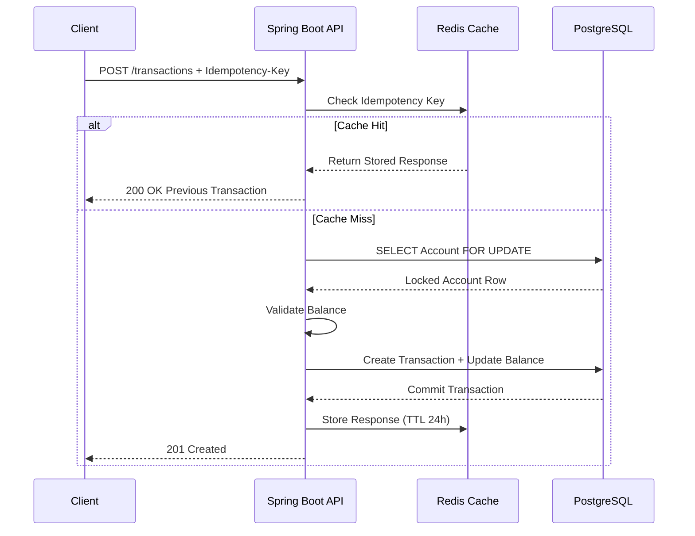

# 🛡️ SecurePay-Gateway - Idempotent Payment Gateway

A high-performance, resilient payment processing system designed to handle **duplicate requests, race conditions, and transaction consistency challenges** in distributed financial systems.

Built using **Java 21, Spring Boot 3, Redis, PostgreSQL, Docker, Flyway, and JPA**.


---

# 📖 About The Project

Payment systems must guarantee two important properties:

### 1. Prevent Duplicate Payments

A user should not be charged twice because of:
- Network failures
- Client retries
- Timeout issues
- Duplicate API requests

### 2. Maintain Data Consistency Under Concurrency

Multiple transactions happening simultaneously should not:
- Corrupt account balances
- Create inconsistent transaction records
- Cause race conditions

**SecurePay-Gateway** solves these problems using:

- **Idempotency Keys stored in Redis**
- **Database-level pessimistic locking**
- **ACID transactions using PostgreSQL**

The system guarantees that the same payment request is processed only once, even when multiple identical requests arrive simultaneously.

---

# 🏗️ Architecture

The application follows a layered architecture focused on reliability and consistency.



---

# ✨ Key Features

## 🔐 Idempotency Handling

- Accepts unique `Idempotency-Key` headers.
- Stores completed responses in Redis.
- Duplicate requests return the previous transaction response.
- Prevents accidental double charging.

---

## 🔒 Concurrency Control

Uses PostgreSQL pessimistic locking:

```
SELECT ... FOR UPDATE
```

This ensures only one transaction can modify an account balance at a time.

---

## 📒 Immutable Audit Trail

Every balance change creates:

- Transaction record
- Ledger entry (`BankEntry`)

Providing a complete transaction history.

---

## ⚡ Performance

Validated using k6 load testing:

- 50+ concurrent users
- Simultaneous debit requests
- Sub-200ms response latency

---

# 🗄️ Database Design

The application uses PostgreSQL as the source of truth.

## Account

Stores customer account information.

Example:

```
Account
---------
id
name
balance
created_at
```

---

## Transaction

Stores payment transaction details.

Example:

```
Transaction
------------
id
account_id
amount
type
status
created_at
```

---

## BankEntry

Maintains an immutable ledger of balance changes.

Example:

```
BankEntry
----------
id
transaction_id
previous_balance
new_balance
created_at
```

Relationship:

```
Account
   |
   |---- Transactions
   |
   |---- Bank Entries
```

---

# 🔥 Why Redis + PostgreSQL?

## Redis

Redis is used for:

- Fast idempotency key lookup
- Storing previous API responses
- TTL-based expiration

Example:

```
Idempotency-Key
        |
        ↓
Redis Cache
        |
        ↓
Return Previous Response
```

---

## PostgreSQL

PostgreSQL is used as the primary database because it provides:

- ACID transactions
- Data durability
- Row-level locking
- Reliable financial data storage

---

# 🛠️ Tech Stack

## Backend

- Java 21
- Spring Boot 3
- Spring Web
- Spring Data JPA
- Spring Data Redis
- Hibernate
- Validation

## Database

- PostgreSQL 15

## Cache

- Redis 7

## Database Migration

- Flyway

## Testing

- JUnit 5
- k6 Load Testing

## Deployment

- Docker
- Docker Compose

---

# 🚀 Quick Start

## Prerequisites

Install:

- Java 21+
- Maven
- Docker
- Docker Compose


---

# 1. Start Infrastructure

Start PostgreSQL and Redis containers:

```bash
docker compose up -d
```

Verify containers:

```bash
docker ps
```

Expected:

```
postgres_db
redis_cache
```

---

# 2. Configure Environment Variables

Create `.env` file:

```env
POSTGRES_DB=postgres_db
POSTGRES_USER=postgres
POSTGRES_PASSWORD=password

REDIS_HOST=localhost
REDIS_PORT=6379
```

---

# 3. Build Application

```bash
mvn clean install
```

---

# 4. Run Application

```bash
mvn spring-boot:run
```

Application starts at:

```
http://localhost:8080
```

---

# 📚 API Documentation

Swagger UI:

```
http://localhost:8080/swagger-ui/index.html
```

---

# 🔌 API Endpoints

## 1. Create Account

Creates a new bank account.

### Request

```
POST /accounts
```

Body:

```json
{
  "name": "John Doe",
  "initialBalance": 1000.00
}
```

Response:

```json
{
  "accountId": "uuid"
}
```

---

# 2. Process Transaction

Creates a debit or credit transaction.

Requires:

```
Idempotency-Key: unique-uuid
```

Request:

```
POST /transactions
```

Body:

```json
{
  "accountId": "account-id",
  "amount": 50.00,
  "type": "DEBIT"
}
```

Response:

```json
{
  "transactionId": "uuid",
  "status": "SUCCESS",
  "amount": 50.00
}
```

---

# 3. Get Account Balance

Request:

```
GET /accounts/{id}/balance
```

Response:

```json
{
  "balance": 950.00
}
```

---

# ⚡ Stress Testing

A k6 script is included to validate concurrency handling.

Scenario:

```
50 users
      |
      |
Same account
      |
      |
Simultaneous debit requests
```

The locking mechanism ensures:

- No negative balance corruption
- No duplicate transactions
- Consistent ledger entries


Run:

```bash
k6 run stress_test.js
```

---

# 📂 Project Structure

```
src/main/java

├── controller
│
├── service
│
├── repository
│
├── entity
│
├── config
│
└── dto
```

---

# 🔮 Future Improvements

- JWT authentication
- Payment provider integration
- Kafka event streaming
- Distributed tracing
- Kubernetes deployment
- CI/CD pipeline

---

# 👩‍💻 Author

**Ishita Rastogi**
